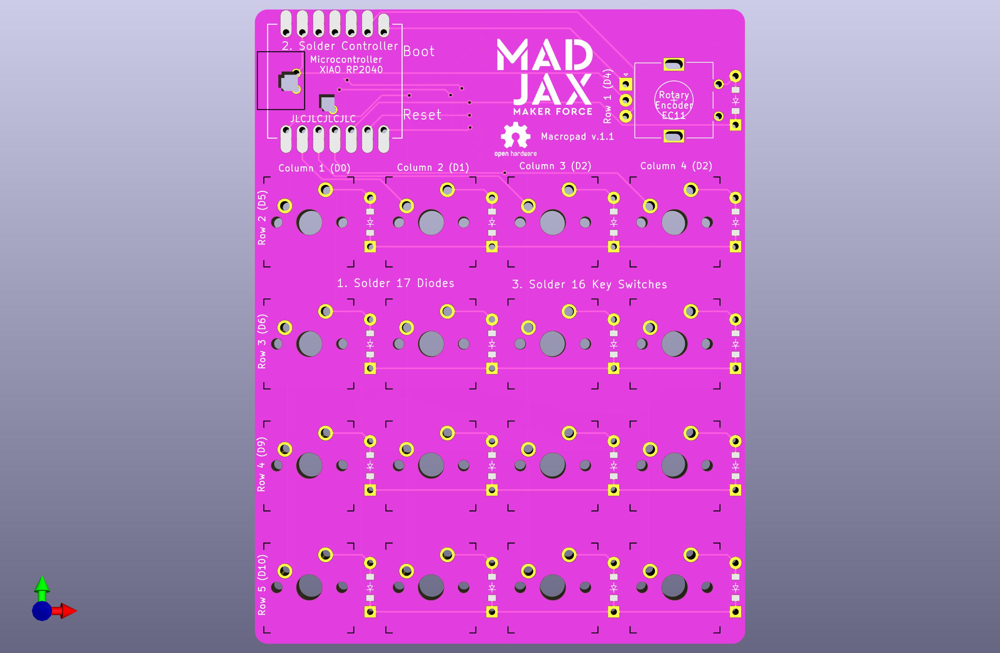
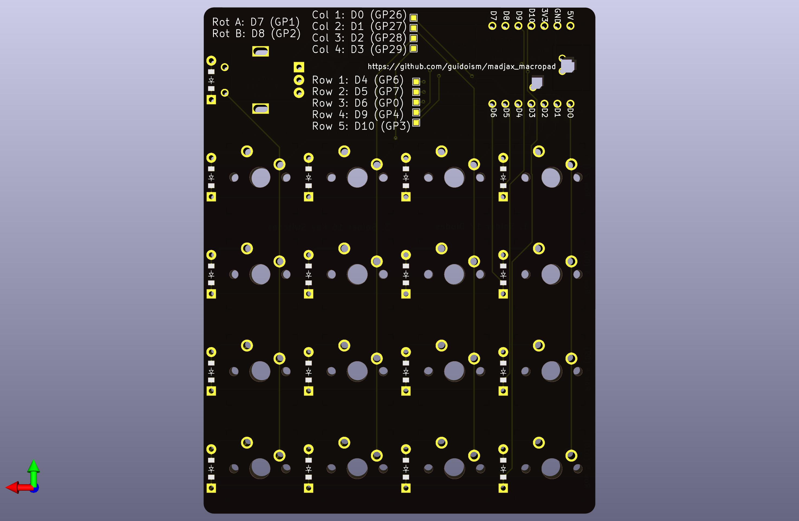

# MadJax Macropad

## Parts

* 1x [Seeed Studio XIAO RP2040](https://www.seeedstudio.com/XIAO-RP2040-v1-0-p-5026.html)
* 17x [Through-hole diodes]()
* 16x [MX-style key switches]()
* 16x [MX-style key caps]()
* 4x [Silicone feet]()
* 1x [USB-C cable]()
* 1x [EC11 Rotary Encoder]()

## Instructions

1. Solder the 17 through-hole diodes onto the front of the PCB
2. Solder the microcontroller onto the front of the PCB
3. Solder the 16 switches
4. Solder the rotary encoder

## Cost on JLCPCB

* 5x $2 + $1.52 shipping
* 10x $5 + $8.11 shipping
* 15x $12.80 + $11.92 shipping
* 20x $15.70 + $14.15 shipping
